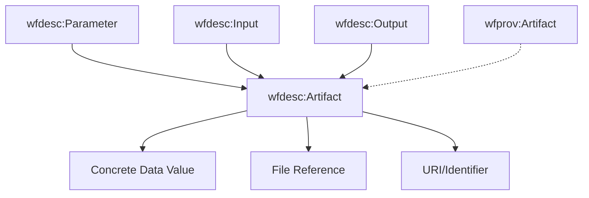

## Artifact

An `Artifact` represents a data value, file, or resource that can be used as input or generated as output by workflow processes.

### Purpose

Artifacts in wfdesc serve as concrete data representations that bridge the abstract workflow structure with actual data values. They can represent:

- **Input data**: Files, datasets, or parameters provided to a workflow
- **Intermediate data**: Data passed between workflow processes  
- **Output data**: Results generated by workflow execution
- **Configuration values**: Concrete parameter settings

### Key Characteristics

- **Data representation**: Encapsulates concrete data values or file references
- **Parameter binding**: Links abstract parameter definitions to actual data
- **Provenance tracking**: Enables tracking of data lineage through workflow execution
- **Type flexibility**: Can represent files, scalar values, complex objects, or URIs

### Relationship to Other Classes



- **Connected to**: `wfdesc:Parameter` via `hasArtifact` property
- **Specializations**: Can be linked to `wfdesc:Input` or `wfdesc:Output` parameters
- **Related**: Similar concept to `wfprov:Artifact` (but for description, not execution)

### Properties

| Property | Type | Description |
|----------|------|-------------|
| `@id` | URI | Unique identifier for the artifact |
| `@type` | String | Must be "Artifact" |
| `value` | Any | The concrete data value or content |
| `mediaType` | String | MIME type of the artifact (for files) |
| `size` | Integer | Size in bytes (for files) |
| `checksum` | Object | Hash/checksum for data integrity |
| `description` | String | Human-readable description |

### Examples

#### Simple scalar value
```json
{
  "@type": "Artifact",
  "@id": "#threshold-value",
  "value": 0.75,
  "description": "Analysis threshold parameter"
}
```

#### File reference
```json
{
  "@type": "Artifact", 
  "@id": "#input-dataset",
  "value": "https://example.org/data/landsat_scene.tif",
  "mediaType": "image/tiff",
  "size": 1048576000,
  "checksum": {
    "algorithm": "SHA-256",
    "value": "a1b2c3d4e5f6..."
  },
  "description": "Landsat 8 satellite imagery for analysis"
}
```

#### Complex configuration object
```json
{
  "@type": "Artifact",
  "@id": "#analysis-config", 
  "value": {
    "algorithm": "random-forest",
    "trees": 100,
    "features": ["ndvi", "elevation", "slope"],
    "validation_split": 0.2
  },
  "description": "Machine learning configuration parameters"
}
```

#### Bounding box coordinates
```json
{
  "@type": "Artifact",
  "@id": "#bbox-myanmar",
  "value": {
    "north": 16.1,
    "south": 15.9, 
    "east": 95.35,
    "west": 95.15
  },
  "description": "Geographic bounding box for Myanmar mangrove analysis"
}
```

### Use Cases

1. **Parameter Binding**: Connecting abstract parameter definitions to concrete values
2. **Data Lineage**: Tracking which specific data was used in workflow execution
3. **Reproducibility**: Recording exact input values for reproducible research
4. **Validation**: Specifying expected data types and formats
5. **Documentation**: Providing metadata about workflow data requirements

### Integration with Parameters

Artifacts are typically linked to parameters via the `hasArtifact` property:

```json
{
  "@type": "Input",
  "@id": "#north-param",
  "name": "north",
  "description": "Northern boundary latitude",
  "hasArtifact": {
    "@type": "Artifact",
    "@id": "#north-value", 
    "value": 16.1,
    "description": "Northern boundary for Myanmar analysis area"
  }
}
```

### JSON-LD Context

```json
{
  "@context": {
    "@vocab": "http://purl.org/wf4ever/wfdesc#",
    "value": "http://www.w3.org/1999/02/22-rdf-syntax-ns#value",
    "mediaType": "http://purl.org/dc/terms/format",
    "size": "http://purl.org/dc/terms/extent",
    "checksum": "http://purl.org/wf4ever/ro#checksum"
  }
}
```

### Best Practices

- **Unique IDs**: Use meaningful identifiers for artifacts, especially for reusable data
- **Type Information**: Include `mediaType` for file-based artifacts
- **Checksums**: Provide checksums for data integrity verification
- **Descriptions**: Add human-readable descriptions for complex artifacts
- **URI vs Value**: Use URIs for large files, embed values for small parameters
- **Consistency**: Use consistent naming conventions across related artifacts