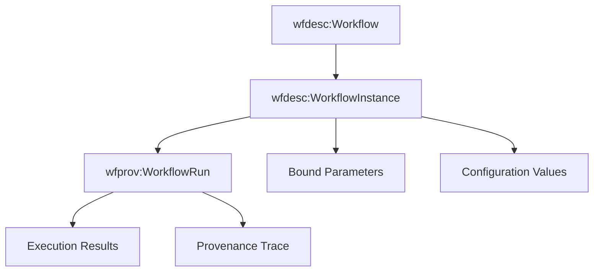

## Workflow Instance

A `WorkflowInstance` represents a specialized workflow description that includes all the concrete data, parameters, and settings required to execute a specific workflow run.

### Purpose

A `WorkflowInstance` is a specialization of `wfdesc:Workflow` that bridges the gap between abstract workflow descriptions and concrete workflow executions. While a `wfdesc:Workflow` defines the general structure and capabilities, a `WorkflowInstance` contains all the specific values, configurations, and bound parameters needed to create a `wfprov:WorkflowRun`.

### Key Characteristics

- **Inherits from Workflow**: A `WorkflowInstance` is a subclass of `wfdesc:Workflow`, so it has all the structural properties (processes, data links, inputs, outputs)
- **Execution-ready**: Contains all bound parameters and concrete values needed for execution
- **Provenance bridge**: Forms the link between workflow descriptions and their execution traces
- **Reproducible**: Captures the exact configuration needed to reproduce a specific workflow execution

### Relationship to Other Classes



- **Extends**: `wfdesc:Workflow` (inherits structure)
- **Prepares**: `wfprov:WorkflowRun` (execution configuration)
- **Contains**: Concrete parameter values and execution settings

### Example Usage

A workflow instance for the KindGrove mangrove analysis with all parameters bound:

```json
{
  "@type": "WorkflowInstance",
  "@id": "#kindgrove-instance-20251103",
  "name": "KindGrove Mangrove Analysis - Myanmar November 2025",
  "describedBy": "#kindgrove-workflow",
  "hasInput": [
    {
      "@id": "#bound-north",
      "@type": "Input", 
      "name": "north",
      "hasArtifact": {
        "@type": "Artifact",
        "value": 16.1
      }
    },
    {
      "@id": "#bound-south", 
      "@type": "Input",
      "name": "south", 
      "hasArtifact": {
        "@type": "Artifact",
        "value": 15.9
      }
    },
    {
      "@id": "#bound-east",
      "@type": "Input",
      "name": "east",
      "hasArtifact": {
        "@type": "Artifact", 
        "value": 95.35
      }
    },
    {
      "@id": "#bound-west",
      "@type": "Input",
      "name": "west",
      "hasArtifact": {
        "@type": "Artifact",
        "value": 95.15
      }
    },
    {
      "@id": "#bound-cloud-cover",
      "@type": "Input",
      "name": "cloud_cover_max",
      "hasArtifact": {
        "@type": "Artifact",
        "value": 20
      }
    },
    {
      "@id": "#bound-days-back",
      "@type": "Input", 
      "name": "days_back",
      "hasArtifact": {
        "@type": "Artifact",
        "value": 90
      }
    },
    {
      "@id": "#bound-output-dir",
      "@type": "Input",
      "name": "output_dir", 
      "hasArtifact": {
        "@type": "Artifact",
        "value": "results"
      }
    }
  ],
  "executionSettings": {
    "engine": "cwltool",
    "version": "3.1.20251031082601",
    "environment": "container",
    "scheduler": "local"
  },
  "readyForExecution": true
}
```

### Properties

| Property | Type | Description |
|----------|------|-------------|
| `describedBy` | `wfdesc:Workflow` | The workflow definition this instance is based on |
| `hasInput` | `wfdesc:Input[]` | Input parameters with bound artifacts/values |
| `hasOutput` | `wfdesc:Output[]` | Expected output parameters |
| `executionSettings` | Object | Engine and environment configuration |
| `readyForExecution` | Boolean | Whether all required parameters are bound |

### Use Cases

1. **Workflow Execution Preparation**: Creating execution-ready configurations from abstract workflow definitions
2. **Reproducible Science**: Storing exact parameter combinations for reproducible research
3. **Provenance Linkage**: Connecting workflow descriptions to their execution traces  
4. **Parameterization**: Managing different parameter sets for the same workflow template
5. **Execution Planning**: Validating that all required inputs are provided before execution

### JSON-LD Context

When used in JSON-LD, the workflow instance inherits the wfdesc context and adds execution-specific terms:

```json
{
  "@context": {
    "@vocab": "http://purl.org/wf4ever/wfdesc#",
    "describedBy": {"@type": "@id"},
    "hasArtifact": {"@type": "@id"},
    "executionSettings": "http://purl.org/wf4ever/wfprov#executionSettings",
    "readyForExecution": {"@type": "http://www.w3.org/2001/XMLSchema#boolean"}
  }
}
```

### Best Practices

- **Complete Parameter Binding**: Ensure all required inputs have bound artifacts
- **Version Tracking**: Include workflow definition version and execution engine details
- **Validation**: Verify parameter types and constraints before marking as execution-ready
- **Documentation**: Include human-readable descriptions of the parameter choices
- **Provenance Preparation**: Structure data to facilitate easy transition to workflow runs